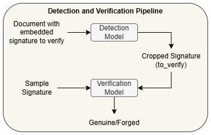
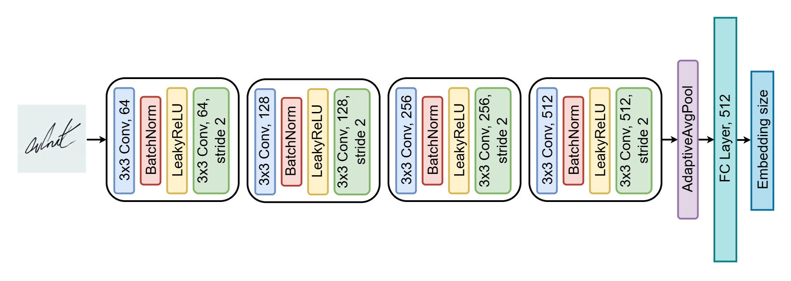

# Signature: Detect To Verify Flow

A full pipeline for automating signature detection and verification from scanned documents. This project integrates object detection to localize signature regions and deep learning–based verification models to classify them as genuine or forged. The system is designed for real-world document analysis, including blended synthetic signatures embedded in actual documents.

**Developed by:** [@Melios22](https://github.com/Melios22) and [@joecao0303](https://github.com/joecao0303)

## Dataset
We built a unified dataset that enables both signature detection and verification tasks, based on two publicly available sources:

- Signature samples from: [Signature Verification Dataset (Kaggle)](https://www.kaggle.com/datasets/robinreni/signature-verification-dataset)  
- Document images with signature regions from: [NanoNets Signature Detection Dataset](https://github.com/NanoNets/SignatureDetectionDataset)

**Modifications applied:**
- Signatures were blended into documents at appropriate signing regions
- Bboxes were re-annotated to reflect embedded signature positions
- Verification labels were assigned based on sample-to-input match (0 = genuine, 1 = forged)

**Dataset size:**
- Train: 23,206 samples  
- Test: 6,195 samples

> View full dataset on Hugging Face: [Mels22/SigDetectVerifyFlow](https://huggingface.co/datasets/Mels22/SigDetectVerifyFlow)

## Pipeline Overview

    
    
Figure 1: Detection and Verification Pipeline.

 

This project follows a two-stage pipeline:

1. 🔎 Signature Detection  
   A detection model (e.g.: YOLO-based) locates signature regions in scanned documents.

2. ✅ Signature Verification  
   The cropped region is compared with a reference (sample_signature) using a verification model to determine if it’s genuine or forged.

Our pre-trained models is available on the Hugging Face Hub at [Mels22/Signature-Detection-Verification](https://huggingface.co/Mels22/Signature-Detection-Verification).

## Model Architectures

This project uses two separate deep learning models for the end-to-end pipeline:

### 1️⃣ Signature Detection — YOLO11

We use the YOLO11 object detection architecture to locate signature regions in document images. The model is trained on document pages with bounding box annotations for each embedded signature.

**Model Info:**
- Base model: `yolo11s.pt` (pretrained from `Ultralytics`)
- Pretrained on: [SignverOD Dataset](https://www.kaggle.com/datasets/victordibia/signverod) — a signature object detection dataset
- Fine-tuned on: our custom blended signature-document dataset

---

### 2️⃣ Signature Verification — Siamese Network

To determine whether a given signature is genuine or forged, we employ a Siamese neural network. The model takes two signature images:
- The to-verify signature cropped from the document
- A reference (sample) signature

The network learns an embedding space where genuine pairs are close and forged pairs are far apart, using a contrastive or binary classification loss.

    
    
Figure 2: Architectural Design for Siamese Model.

 

> The Siamese model can be trained using triplet loss, contrastive loss, or binary classification depending on the training formulation.

---

🧩 Both models are trained independently and combined during inference for full-pipeline evaluation.

## Future Work

Several directions can further enhance the robustness and real-world performance of this pipeline:
- ***Multi-head Detection:*** Improve detection of small/large signatures by adding multi-scale heads.
- ***Transformer-based Models:*** Use attention mechanisms for better context-aware detection in complex layouts.
- ***Crop Enhancement:*** Apply image enhancement (e.g., super-resolution) to improve signature quality before verification.
- ***Dynamic Verification:*** Enable support for new signatories without retraining via embedding caching or online learning.
- ***End-to-End Pipeline:*** Unify detection and verification into a jointly trainable model to reduce stage-wise error.

> These upgrades aim to create a scalable, real-world–ready signature verification system.

## 🙏 Acknowledgements

Thank you to everyone who contributed ideas, feedback, and support throughout this project.  
Special thanks to the creators of the original datasets and the open-source community for providing the tools that made this pipeline possible.

We hope this work helps others build better and more accessible signature verification systems.

  <a href="#readme-top">⬆️ Back to top</a>

